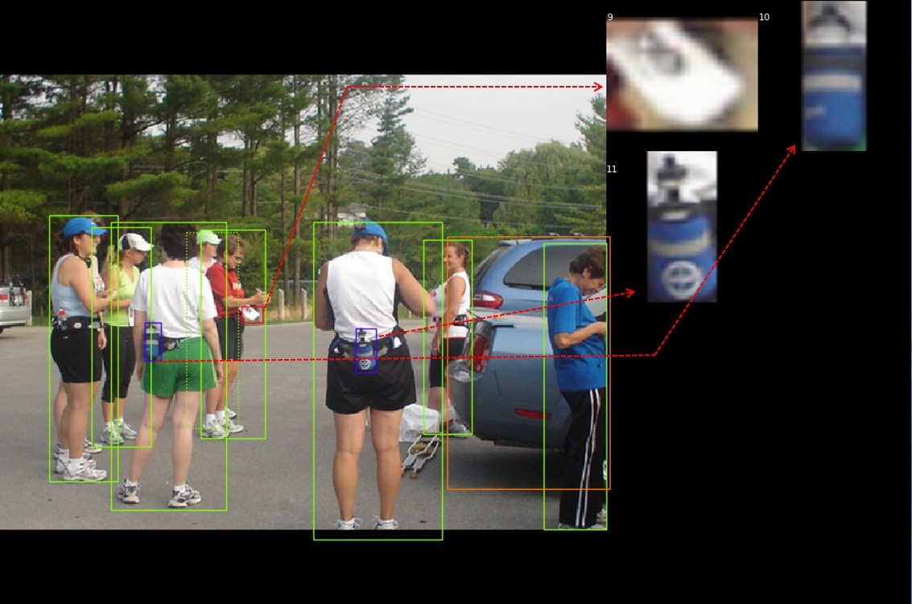
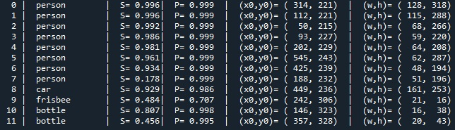
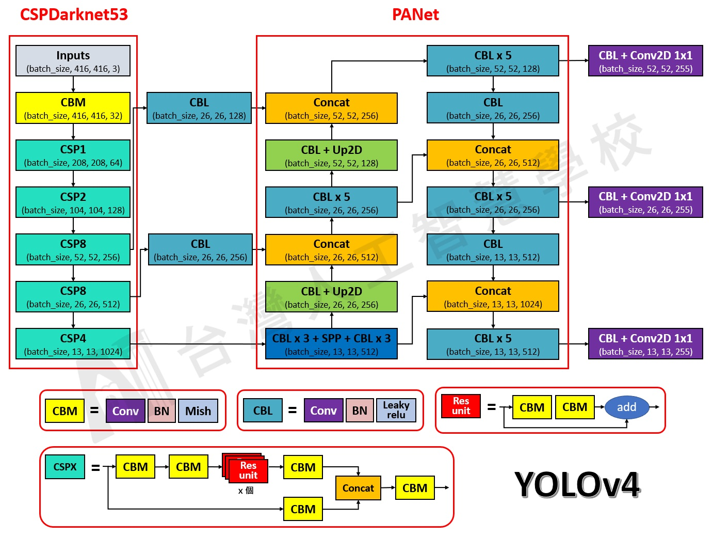
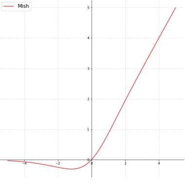
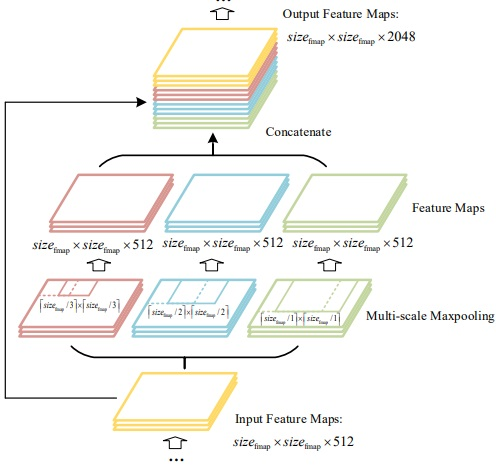
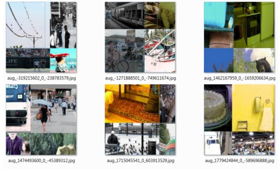
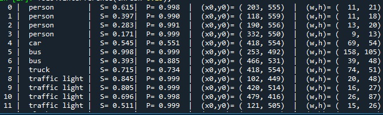
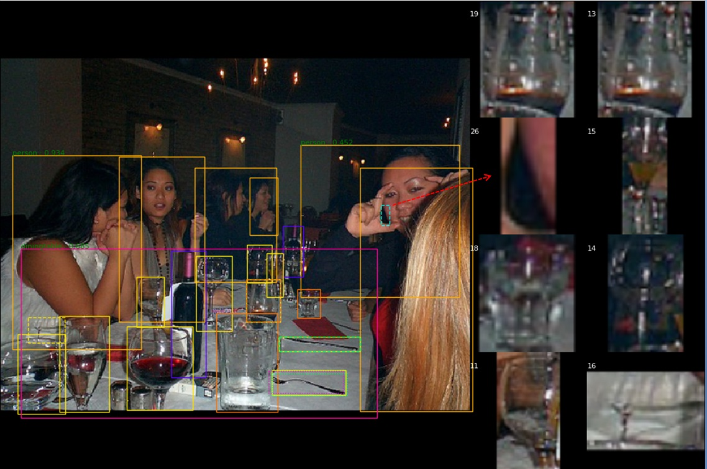
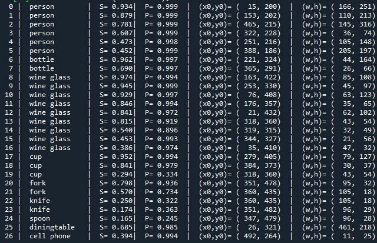

## YOLO V4 (You Only Look Once, version4) - using TensorFlow 2.1

 

Tensorflow 2.1 implementation for YOLO V4
 

## YOLO V4 Detection example:
Folloing picture illustrates the capability of object localization and object identification capability of YOLO V4. Table below lists objects recoginized by YOLO V4. S represents probability of each object where 1 means 100% sure. P represents confidence level of the object class. (x0, y0) means left and top boundary. (w,h) means width and height of the box. YOLO V4 employs PANet to fuse local and global feature map (receptive field) and performs well for both large object (object 0, 1) and small object (object 9, 10, 11 which are amplified on the right of image). 
 
  

----
## YOLO V4 network
The network of YOLO V4 is comprised of backbone, neck and head. Backbone is CSP-Darknet53. Darknet53 is backbone of YOLO V3. It is comprised of 53layers CBL (Conv-BN-LeakyReLU) blocks. YOLO V4 combined CSPnet and Darket to reduce the computation power and improves accuracy simultaneously. Neck is comprised of SPPnet and PANet. SPPnet enlarges receptive field while PANet fuses global and local feature map. 

 
(Refer to 台灣人工智慧學校)

----
## YOLO V4 activation- Mish
LeakyReLU activation expose gradient discontinuity at zero input. The activiation function in YOLO V4 backbone is replaced by Mish. Mish behaves more smoothly and prevent from gradient discontinuouity. 

 

----
## SPPnet
YOLO V4 utilizes SPPnet to enlarge receptive of field.

 

----
## Data augmentation 
YOLO V4 uses Mosaic (mosaic 4 pictures into one) to enlarge the dataset. 

 

----
## Difference between YOLO V3 and YOLO V4
|    |YOLO V3 |YOLO V4|Remark|
|----|----|----|----|
|Backbone |Darknet53 |CSP-Darknet53 | Reduce parameters, improve accuracy|
|Neck|FPN|PANet + SPP|Fusion local and global features|
|Head|YOLO|YOLO|None|
|Activations|LeakyReLU|LeakyReLU + Mish|Stable gradient|
|Bounding box regression loss|MSE loss|CIou loss|Improve accuracy|
|Normalization|BN|CmBN|Suitable for small batch|
|Augmentation|pixel-wise adjustment|Mosaic|Reduce GPU power|
|Loss function|None|Label smoothing + Grid sensitivity| |

----
## Example: Global and local receptive field
Following picture illustrates how global receptive field helps to identify small object. Object 3 is a person sitting in the bus. The PANet struture help to pass the information of  large scale receptive of field to small obejct. That is, YOLO V4 identifies object 3 is 'person' because that the object is inside the window of bus. 
 
  

## False positive example:
YOLO V4 detects 26 objects in the folloing picture. Object 26 is simply a black blank space between hand and face. However, YOLO V4 'guess' it is a cell phone. This is because YOLO V4 'seen' many cellphone is hold near the ear. Of course, it is false positive. 
 
  

----
## Reference:
> **YOLOv4: Optimal Speed and Accuracy of Object Detection**
> Alexey Bochkovskiy, Chien-Yao Wang, Hong-Yuan Mark Liao
> [PDF] https://arxiv.org/abs/2004.10934

