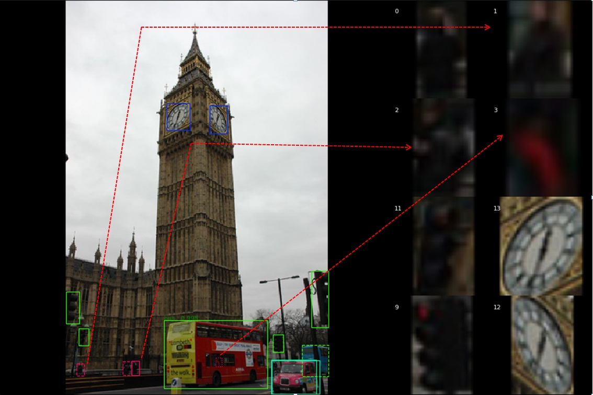

## YOLO4 (You Only Look Once, version4) - using TensorFlow 2.1

 

Tensorflow 2.1 implementation for YOLO V4

## YOLO V4 Detection example:
Folloing picture illustrates the capability of object localization and object identification capability of YOLO V4. Table below lists objects recoginized by YOLO V4. S represents probability of each object where 1 means 100% sure. P represents confidence level of the object class. (x0, y0) means left and top boundary. (w,h) means width and height of the box.  
It is clear that YOLO V4 performance well for both large object (object 0, 1) and small object (object 9, 10, 11 which are amplified on the right of image). 
 
  

 
  

## False positive example:
YOLO V4 detects 26 objects Folloing picture 
 
  

